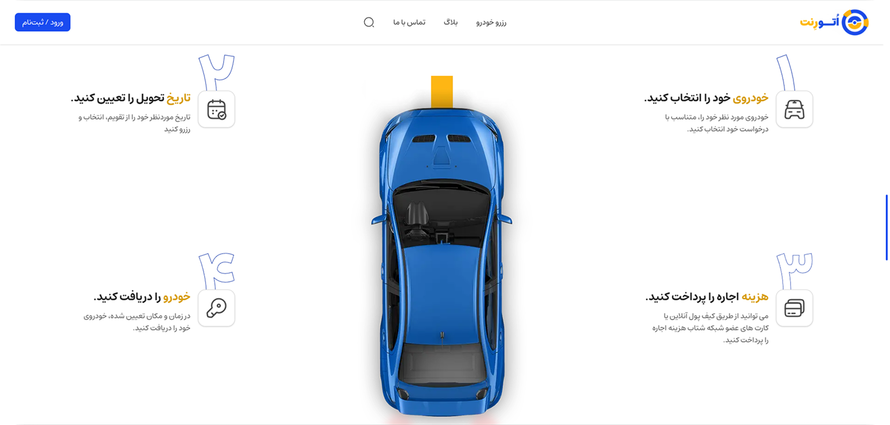

  

<h3 align="center">Auto Rent</h3>

  <a href="https://artazanjani.github.io/AutoRent/" style="margin: 0 10px;">View Demo</a>

## 📸 Preview

## 🚀 Features

- Advanced admin panel  
- High performance optimization and high loading speed  
- Advanced search capabilities with multiple filters  
- Developed using the latest and most advanced libraries  

## 🛠️ Tech Stack

| Tech          | Description                 |
| ------------- | --------------------------- |
| React         | Frontend library            |
| React Router  | Routing library for React   |
| Tailwind CSS  | Utility-first CSS framework |
| Shadcn UI     | UI component library        |
| Framer Motion | Animation library for React |
| Swiper        | JavaScript library for sliders |
| Leaflet       | Interactive maps library |
| Iconsax       | Icon font scripts           |
